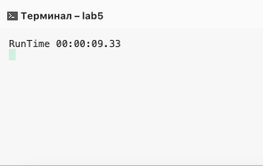
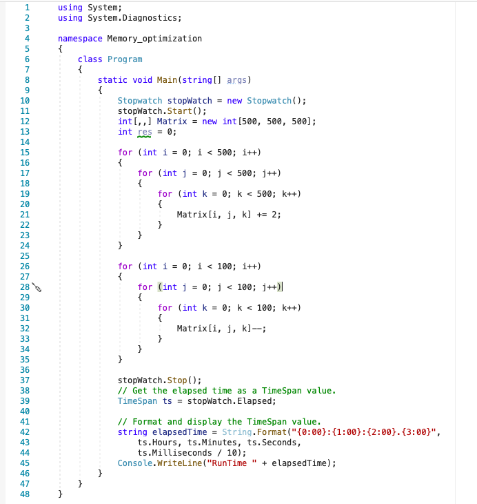
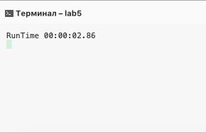

# MemoryOptimization

### Сode before optimization

```
static void Main(string[] args)
      
      {
            int[,,,] Matrix= new int[10,10,10];
            int res = 0;

	    for (int i = 0; i < 10; i++)
            {
                for (int j = 0; j < 10; j++)
                {
                    for (int k = 0; k < 10; k++)
                    {
                        Matrix[k, j, i]+=2;
                    }
                }
            }

            for (int i = 0; i < 10; i++)
            {
                for (int j = 0; j < 10; j++)
                {
                    for (int k = 0; k < 10; k++)
                    {
                        Matrix[k, j, i]--;
                    }
                }
            }
            

        }
```
### Result
 ​
### Сode after optimization
 ​
 ### Result
 ​

